# [📈 Live Status](https://quanhieu.github.io/alive_up/): <!--live status--> **🟧 Partial outage**

This repository contains the open-source uptime monitor and status page for [Hieu Quang](https://quanhieu.github.io/alive_up), powered by [Upptime](https://github.com/upptime/upptime).

With [Upptime](https://upptime.js.org), you can get your own unlimited and free uptime monitor and status page, powered entirely by a GitHub repository. We use [Issues](https://github.com/quanhieu/alive_up/issues) as incident reports, [Actions](https://github.com/quanhieu/alive_up/actions) as uptime monitors, and [Pages](https://quanhieu.github.io/alive_up) for the status page.

<!--start: status pages-->
<!-- This summary is generated by Upptime (https://github.com/upptime/upptime) -->
<!-- Do not edit this manually, your changes will be overwritten -->
<!-- prettier-ignore -->
| URL | Status | History | Response Time | Uptime |
| --- | ------ | ------- | ------------- | ------ |
|  [Pikalog](https://kipalog.com/) | 🟥 Down | [pikalog.yml](https://github.com/quanhieu/alive_up/commits/HEAD/history/pikalog.yml) | 

 0ms
     
 | 

<a href="https://quanhieu.github.io/alive_up/history/pikalog">0.00%</a>
    

|  [Viblo](https://viblo.asia/followings) | 🟩 Up | [viblo.yml](https://github.com/quanhieu/alive_up/commits/HEAD/history/viblo.yml) | 

 2036ms
     
 | 

<a href="https://quanhieu.github.io/alive_up/history/viblo">0.00%</a>
    

|  [devto](https://dev.to/) | 🟩 Up | [devto.yml](https://github.com/quanhieu/alive_up/commits/HEAD/history/devto.yml) | 

 246ms
     
 | 

<a href="https://quanhieu.github.io/alive_up/history/devto">100.00%</a>
    

|  [dailydev](https://app.daily.dev/) | 🟩 Up | [dailydev.yml](https://github.com/quanhieu/alive_up/commits/HEAD/history/dailydev.yml) | 

 133ms
     
 | 

<a href="https://quanhieu.github.io/alive_up/history/dailydev">100.00%</a>
    

|  [patternsJs](https://www.patterns.dev) | 🟩 Up | [patterns-js.yml](https://github.com/quanhieu/alive_up/commits/HEAD/history/patterns-js.yml) | 

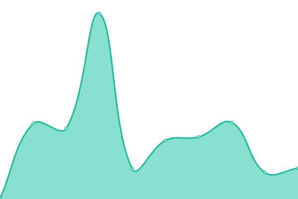 254ms
     
 | 

<a href="https://quanhieu.github.io/alive_up/history/patterns-js">100.00%</a>
    

|  [refactoring](https://refactoring.guru/design-patterns) | 🟩 Up | [refactoring.yml](https://github.com/quanhieu/alive_up/commits/HEAD/history/refactoring.yml) | 

 719ms
     
 | 

<a href="https://quanhieu.github.io/alive_up/history/refactoring">100.00%</a>
    

|  [giaosucan](https://www.giaosucan.com/) | 🟩 Up | [giaosucan.yml](https://github.com/quanhieu/alive_up/commits/HEAD/history/giaosucan.yml) | 

 1500ms
     
 | 

<a href="https://quanhieu.github.io/alive_up/history/giaosucan">100.00%</a>
    

|  [niviki](https://www.niviki.com) | 🟥 Down | [niviki.yml](https://github.com/quanhieu/alive_up/commits/HEAD/history/niviki.yml) | 

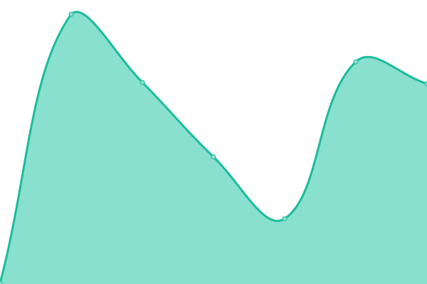 0ms
     
 | 

<a href="https://quanhieu.github.io/alive_up/history/niviki">0.00%</a>
    

|  [duyet](https://blog.duyet.net/) | 🟩 Up | [duyet.yml](https://github.com/quanhieu/alive_up/commits/HEAD/history/duyet.yml) | 

 248ms
     
 | 

<a href="https://quanhieu.github.io/alive_up/history/duyet">100.00%</a>
    

|  [medium](https://medium.com/) | 🟩 Up | [medium.yml](https://github.com/quanhieu/alive_up/commits/HEAD/history/medium.yml) | 

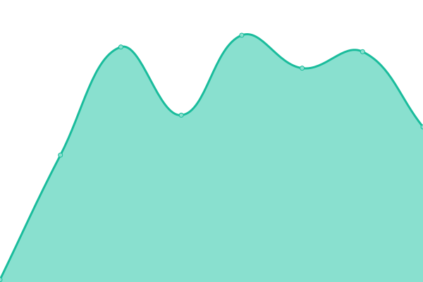 135ms
     
 | 

<a href="https://quanhieu.github.io/alive_up/history/medium">100.00%</a>
    

|  [cuongquach](https://cuongquach.com/) | 🟩 Up | [cuongquach.yml](https://github.com/quanhieu/alive_up/commits/HEAD/history/cuongquach.yml) | 

 1832ms
     
 | 

<a href="https://quanhieu.github.io/alive_up/history/cuongquach">100.00%</a>
    

|  [shipit](https://shipit.dev/posts/kubernetes-overview-diagrams.html) | 🟩 Up | [shipit.yml](https://github.com/quanhieu/alive_up/commits/HEAD/history/shipit.yml) | 

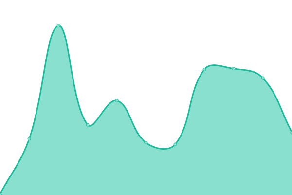 138ms
     
 | 

<a href="https://quanhieu.github.io/alive_up/history/shipit">100.00%</a>
    

|  [cloudnativeviet](https://www.cloudnativeviet.net/documents/kubernetes/) | 🟩 Up | [cloudnativeviet.yml](https://github.com/quanhieu/alive_up/commits/HEAD/history/cloudnativeviet.yml) | 

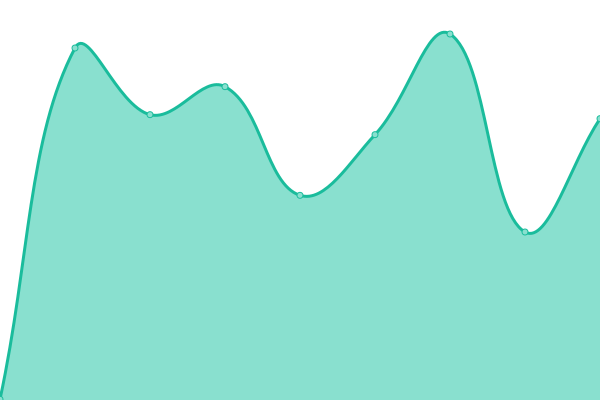 431ms
     
 | 

<a href="https://quanhieu.github.io/alive_up/history/cloudnativeviet">0.00%</a>
    

|  [xuanthulab](https://xuanthulab.net/) | 🟩 Up | [xuanthulab.yml](https://github.com/quanhieu/alive_up/commits/HEAD/history/xuanthulab.yml) | 

 1240ms
     
 | 

<a href="https://quanhieu.github.io/alive_up/history/xuanthulab">100.00%</a>
    

|  [anonystick - Tips Javascript](https://anonystick.com/) | 🟩 Up | [anonystick-tips-javascript.yml](https://github.com/quanhieu/alive_up/commits/HEAD/history/anonystick-tips-javascript.yml) | 

 1494ms
     
 | 

<a href="https://quanhieu.github.io/alive_up/history/anonystick-tips-javascript">100.00%</a>
    

|  [guru99](https://www.guru99.com/) | 🟩 Up | [guru99.yml](https://github.com/quanhieu/alive_up/commits/HEAD/history/guru99.yml) | 

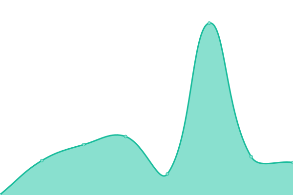 141ms
     
 | 

<a href="https://quanhieu.github.io/alive_up/history/guru99">100.00%</a>
    

|  [dnsimple](https://dnsimple.com/comics) | 🟩 Up | [dnsimple.yml](https://github.com/quanhieu/alive_up/commits/HEAD/history/dnsimple.yml) | 

 194ms
     
 | 

<a href="https://quanhieu.github.io/alive_up/history/dnsimple">0.00%</a>
    

|  [howhttps](https://howhttps.works/) | 🟩 Up | [howhttps.yml](https://github.com/quanhieu/alive_up/commits/HEAD/history/howhttps.yml) | 

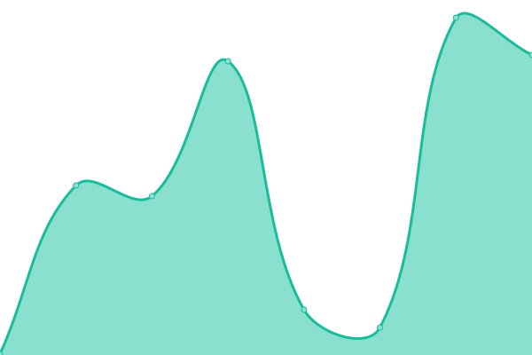 266ms
     
 | 

<a href="https://quanhieu.github.io/alive_up/history/howhttps">100.00%</a>
    

|  [wizardzines](https://wizardzines.com/comics/) | 🟩 Up | [wizardzines.yml](https://github.com/quanhieu/alive_up/commits/HEAD/history/wizardzines.yml) | 

 377ms
     
 | 

<a href="https://quanhieu.github.io/alive_up/history/wizardzines">100.00%</a>
    

|  [Ani 47](https://anime47.com/) | 🟩 Up | [ani-47.yml](https://github.com/quanhieu/alive_up/commits/HEAD/history/ani-47.yml) | 

 2151ms
     
 | 

<a href="https://quanhieu.github.io/alive_up/history/ani-47">100.00%</a>
    

|  [Ani pro](http://animevietsub.pro/) | 🟩 Up | [ani-pro.yml](https://github.com/quanhieu/alive_up/commits/HEAD/history/ani-pro.yml) | 

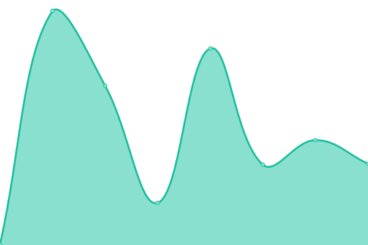 462ms
     
 | 

<a href="https://quanhieu.github.io/alive_up/history/ani-pro">100.00%</a>
    

|  [Ani tvn](https://animetvn.info/) | 🟩 Up | [ani-tvn.yml](https://github.com/quanhieu/alive_up/commits/HEAD/history/ani-tvn.yml) | 

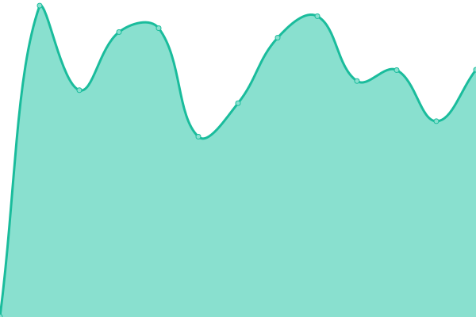 871ms
     
 | 

<a href="https://quanhieu.github.io/alive_up/history/ani-tvn">100.00%</a>
    

|  [Ani 4u](https://ani4u.org/) | 🟩 Up | [ani-4u.yml](https://github.com/quanhieu/alive_up/commits/HEAD/history/ani-4u.yml) | 

 1669ms
     
 | 

<a href="https://quanhieu.github.io/alive_up/history/ani-4u">100.00%</a>
    

|  [Ani Vuighe](https://vuighe.net/) | 🟩 Up | [ani-vuighe.yml](https://github.com/quanhieu/alive_up/commits/HEAD/history/ani-vuighe.yml) | 

 1594ms
     
 | 

<a href="https://quanhieu.github.io/alive_up/history/ani-vuighe">100.00%</a>
    

|  [Ani clip](https://clipanime.com/) | 🟩 Up | [ani-clip.yml](https://github.com/quanhieu/alive_up/commits/HEAD/history/ani-clip.yml) | 

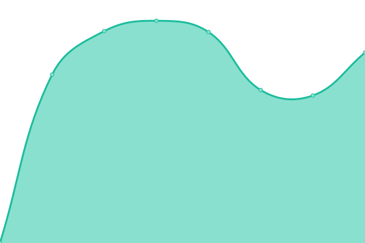 2580ms
     
 | 

<a href="https://quanhieu.github.io/alive_up/history/ani-clip">100.00%</a>
    

|  [Ani pops](https://pops.vn/anime) | 🟩 Up | [ani-pops.yml](https://github.com/quanhieu/alive_up/commits/HEAD/history/ani-pops.yml) | 

 2272ms
     
 | 

<a href="https://quanhieu.github.io/alive_up/history/ani-pops">100.00%</a>
    

|  [Ani muse](https://www.youtube.com/@MuseVietnam/featured) | 🟩 Up | [ani-muse.yml](https://github.com/quanhieu/alive_up/commits/HEAD/history/ani-muse.yml) | 

 1992ms
     
 | 

<a href="https://quanhieu.github.io/alive_up/history/ani-muse">100.00%</a>
    

|  [clip-sub](https://clip-sub.com/) | 🟩 Up | [clip-sub.yml](https://github.com/quanhieu/alive_up/commits/HEAD/history/clip-sub.yml) | 

 561ms
     
 | 

<a href="https://quanhieu.github.io/alive_up/history/clip-sub">100.00%</a>
    

|  [yami-sora](https://www.yami-sora.org/) | 🟥 Down | [yami-sora.yml](https://github.com/quanhieu/alive_up/commits/HEAD/history/yami-sora.yml) | 

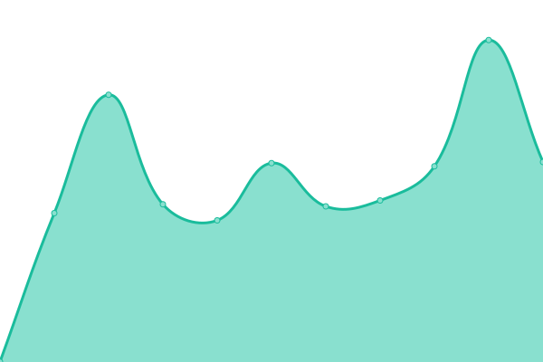 1396ms
     
 | 

<a href="https://quanhieu.github.io/alive_up/history/yami-sora">60.51%</a>
    

|  [relieftranslation](https://relieftranslation.com/anime/) | 🟥 Down | [relieftranslation.yml](https://github.com/quanhieu/alive_up/commits/HEAD/history/relieftranslation.yml) | 

 3315ms
     
 | 

<a href="https://quanhieu.github.io/alive_up/history/relieftranslation">0.00%</a>
    

|  [Yoakefs](https://yoakefs.com/) | 🟩 Up | [yoakefs.yml](https://github.com/quanhieu/alive_up/commits/HEAD/history/yoakefs.yml) | 

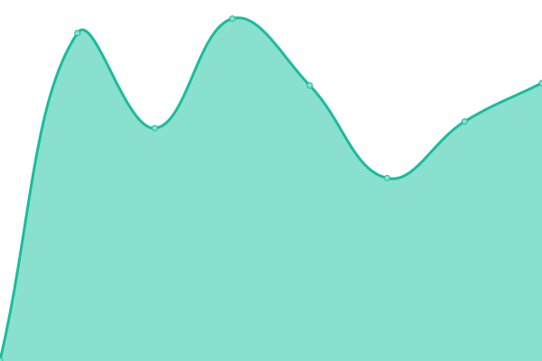 572ms
     
 | 

<a href="https://quanhieu.github.io/alive_up/history/yoakefs">100.00%</a>
    

|  [kanefusafs](https://www.kanefusafs.net/) | 🟩 Up | [kanefusafs.yml](https://github.com/quanhieu/alive_up/commits/HEAD/history/kanefusafs.yml) | 

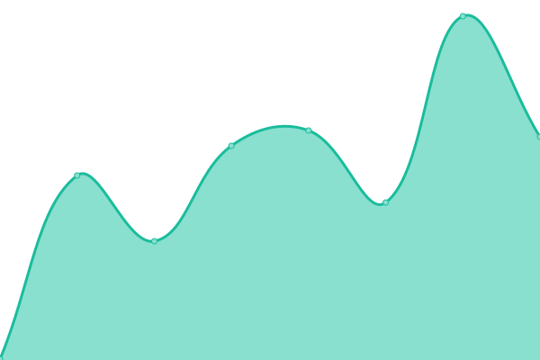 194ms
     
 | 

<a href="https://quanhieu.github.io/alive_up/history/kanefusafs">100.00%</a>
    

|  [kimi](https://kimi-fansub.blogspot.com/) | 🟩 Up | [kimi.yml](https://github.com/quanhieu/alive_up/commits/HEAD/history/kimi.yml) | 

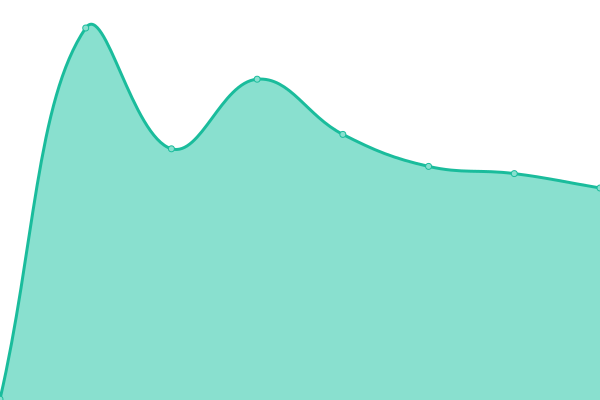 411ms
     
 | 

<a href="https://quanhieu.github.io/alive_up/history/kimi">100.00%</a>
    

|  [smfs](https://sm-f.blogspot.com/) | 🟩 Up | [smfs.yml](https://github.com/quanhieu/alive_up/commits/HEAD/history/smfs.yml) | 

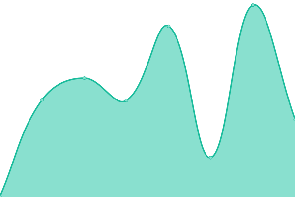 206ms
     
 | 

<a href="https://quanhieu.github.io/alive_up/history/smfs">100.00%</a>
    

|  [a4vf](https://a4vf.com/) | 🟩 Up | [a4vf.yml](https://github.com/quanhieu/alive_up/commits/HEAD/history/a4vf.yml) | 

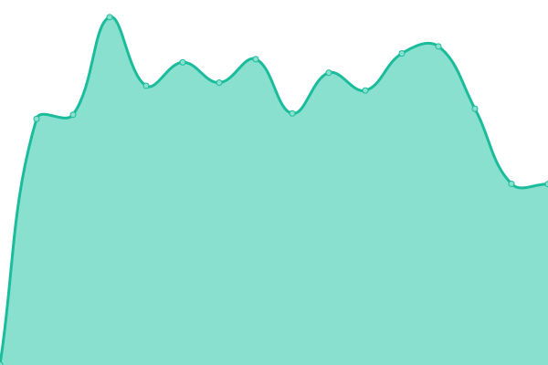 1231ms
     
 | 

<a href="https://quanhieu.github.io/alive_up/history/a4vf">73.54%</a>
    

|  [koga](http://koga-fansub.net/) | 🟩 Up | [koga.yml](https://github.com/quanhieu/alive_up/commits/HEAD/history/koga.yml) | 

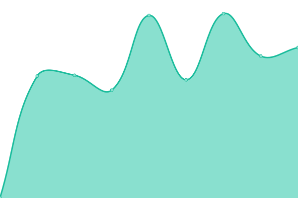 1901ms
     
 | 

<a href="https://quanhieu.github.io/alive_up/history/koga">100.00%</a>
    

|  [vnfs](https://vnfs-team.com/) | 🟩 Up | [vnfs.yml](https://github.com/quanhieu/alive_up/commits/HEAD/history/vnfs.yml) | 

 1247ms
     
 | 

<a href="https://quanhieu.github.io/alive_up/history/vnfs">99.85%</a>
    

|  [cabfansub](https://cabfansub.com/) | 🟩 Up | [cabfansub.yml](https://github.com/quanhieu/alive_up/commits/HEAD/history/cabfansub.yml) | 

 484ms
     
 | 

<a href="https://quanhieu.github.io/alive_up/history/cabfansub">100.00%</a>
    

|  [crazysol](https://crazysol.blogspot.com/) | 🟩 Up | [crazysol.yml](https://github.com/quanhieu/alive_up/commits/HEAD/history/crazysol.yml) | 

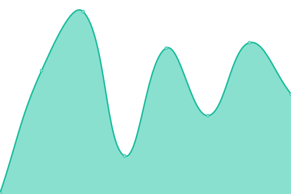 190ms
     
 | 

<a href="https://quanhieu.github.io/alive_up/history/crazysol">100.00%</a>
    

|  [zingfansub](https://zingfansub.ws/zfs/) | 🟩 Up | [zingfansub.yml](https://github.com/quanhieu/alive_up/commits/HEAD/history/zingfansub.yml) | 

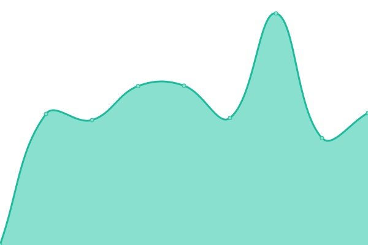 2363ms
     
 | 

<a href="https://quanhieu.github.io/alive_up/history/zingfansub">99.71%</a>
    

|  [olshiro](http://olshiro.net/load/vietsub/10) | 🟩 Up | [olshiro.yml](https://github.com/quanhieu/alive_up/commits/HEAD/history/olshiro.yml) | 

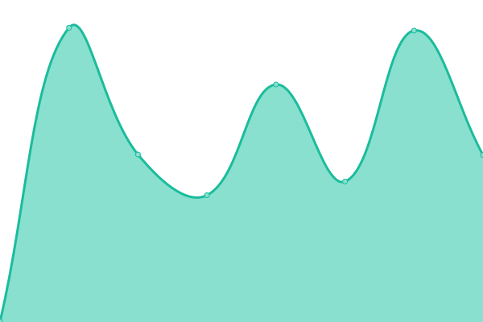 471ms
     
 | 

<a href="https://quanhieu.github.io/alive_up/history/olshiro">100.00%</a>
    

|  [yureisub](https://www.yureisub.com/) | 🟩 Up | [yureisub.yml](https://github.com/quanhieu/alive_up/commits/HEAD/history/yureisub.yml) | 

 866ms
     
 | 

<a href="https://quanhieu.github.io/alive_up/history/yureisub">100.00%</a>
    

|  [ashirogifs](https://ashirogifs.blogspot.com/) | 🟩 Up | [ashirogifs.yml](https://github.com/quanhieu/alive_up/commits/HEAD/history/ashirogifs.yml) | 

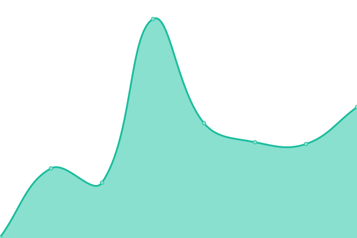 166ms
     
 | 

<a href="https://quanhieu.github.io/alive_up/history/ashirogifs">100.00%</a>
    

|  [jikanfansub](https://jikanfansub.wordpress.com/) | 🟩 Up | [jikanfansub.yml](https://github.com/quanhieu/alive_up/commits/HEAD/history/jikanfansub.yml) | 

 278ms
     
 | 

<a href="https://quanhieu.github.io/alive_up/history/jikanfansub">100.00%</a>
    

|  [vnjp - doremonfs](http://www.vnjp.us/) | 🟩 Up | [vnjp-doremonfs.yml](https://github.com/quanhieu/alive_up/commits/HEAD/history/vnjp-doremonfs.yml) | 

 674ms
     
 | 

<a href="https://quanhieu.github.io/alive_up/history/vnjp-doremonfs">100.00%</a>
    

|  [wakanafs](https://wakanafs.blogspot.com/) | 🟩 Up | [wakanafs.yml](https://github.com/quanhieu/alive_up/commits/HEAD/history/wakanafs.yml) | 

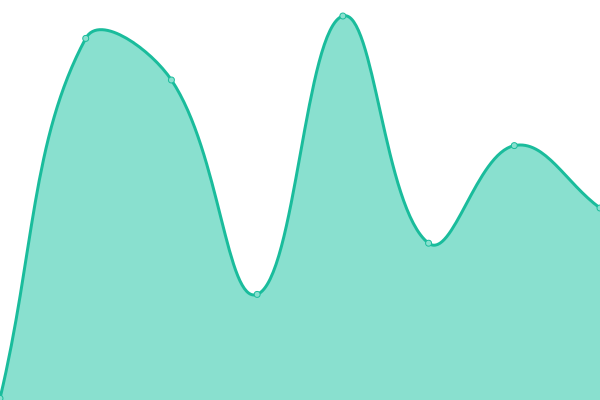 151ms
     
 | 

<a href="https://quanhieu.github.io/alive_up/history/wakanafs">100.00%</a>
    

|  [waya](http://waya.itea.vn/) | 🟥 Down | [waya.yml](https://github.com/quanhieu/alive_up/commits/HEAD/history/waya.yml) | 

 0ms
     
 | 

<a href="https://quanhieu.github.io/alive_up/history/waya">0.00%</a>
    

|  [nyaafs](http://nyaa-fansub.net/) | 🟩 Up | [nyaafs.yml](https://github.com/quanhieu/alive_up/commits/HEAD/history/nyaafs.yml) | 

 68ms
     
 | 

<a href="https://quanhieu.github.io/alive_up/history/nyaafs">100.00%</a>
    

|  [conanvnfansub](https://conanvnfansub.wordpress.com/) | 🟩 Up | [conanvnfansub.yml](https://github.com/quanhieu/alive_up/commits/HEAD/history/conanvnfansub.yml) | 

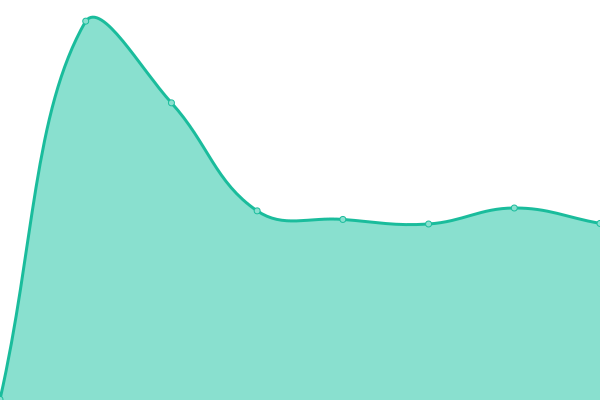 436ms
     
 | 

<a href="https://quanhieu.github.io/alive_up/history/conanvnfansub">100.00%</a>
    

|  [vnkeyfc](https://vnkeyfc.com/) | 🟩 Up | [vnkeyfc.yml](https://github.com/quanhieu/alive_up/commits/HEAD/history/vnkeyfc.yml) | 

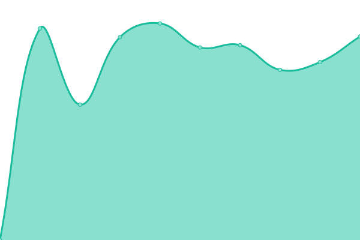 2942ms
     
 | 

<a href="https://quanhieu.github.io/alive_up/history/vnkeyfc">100.00%</a>
    

|  [otakumano](https://otakumano4fan.blogspot.com/) | 🟩 Up | [otakumano.yml](https://github.com/quanhieu/alive_up/commits/HEAD/history/otakumano.yml) | 

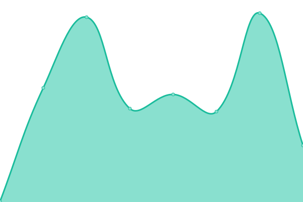 180ms
     
 | 

<a href="https://quanhieu.github.io/alive_up/history/otakumano">100.00%</a>
    

|  [pokemonviet](https://pokemonviet.com/) | 🟩 Up | [pokemonviet.yml](https://github.com/quanhieu/alive_up/commits/HEAD/history/pokemonviet.yml) | 

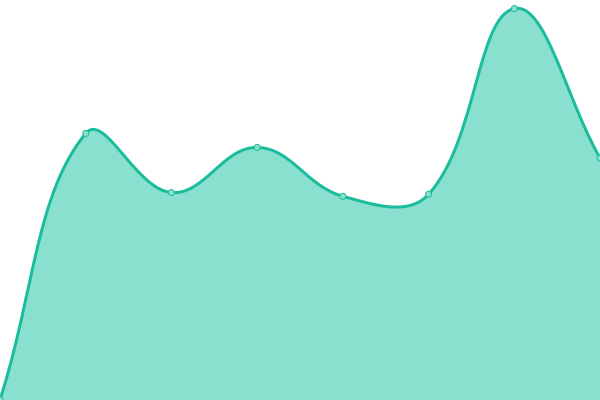 801ms
     
 | 

<a href="https://quanhieu.github.io/alive_up/history/pokemonviet">100.00%</a>
    

|  [a4vf](https://a4vf.net/) | 🟩 Up | [a4vf.yml](https://github.com/quanhieu/alive_up/commits/HEAD/history/a4vf.yml) | 

 1231ms
     
 | 

<a href="https://quanhieu.github.io/alive_up/history/a4vf">73.54%</a>
    

|  [Nishiro Fansub](https://www.notion.so/Animulism-342a41414b0b43c9aa5b10e242f718a1) | 🟩 Up | [nishiro-fansub.yml](https://github.com/quanhieu/alive_up/commits/HEAD/history/nishiro-fansub.yml) | 

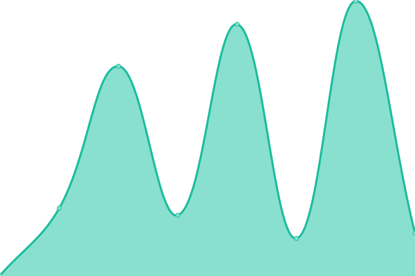 289ms
     
 | 

<a href="https://quanhieu.github.io/alive_up/history/nishiro-fansub">100.00%</a>
    

|  [nekofansub](https://nekofansubblog.wordpress.com/) | 🟩 Up | [nekofansub.yml](https://github.com/quanhieu/alive_up/commits/HEAD/history/nekofansub.yml) | 

 407ms
     
 | 

<a href="https://quanhieu.github.io/alive_up/history/nekofansub">100.00%</a>
    

|  [flyfansub](https://flyfansub.blogspot.com/) | 🟩 Up | [flyfansub.yml](https://github.com/quanhieu/alive_up/commits/HEAD/history/flyfansub.yml) | 

 167ms
     
 | 

<a href="https://quanhieu.github.io/alive_up/history/flyfansub">100.00%</a>
    

|  [luclacmeo](https://luclacmeo.wordpress.com/) | 🟩 Up | [luclacmeo.yml](https://github.com/quanhieu/alive_up/commits/HEAD/history/luclacmeo.yml) | 

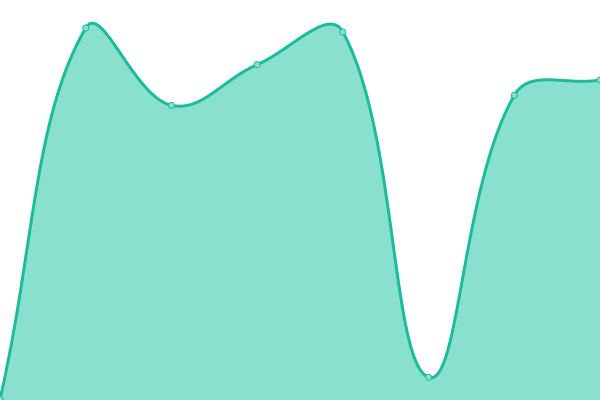 533ms
     
 | 

<a href="https://quanhieu.github.io/alive_up/history/luclacmeo">100.00%</a>
    

|  [mochifansub](https://mochifansub.home.blog/) | 🟩 Up | [mochifansub.yml](https://github.com/quanhieu/alive_up/commits/HEAD/history/mochifansub.yml) | 

 448ms
     
 | 

<a href="https://quanhieu.github.io/alive_up/history/mochifansub">100.00%</a>
    

|  [relnguyen](https://relnguyen.blogspot.com/) | 🟩 Up | [relnguyen.yml](https://github.com/quanhieu/alive_up/commits/HEAD/history/relnguyen.yml) | 

 479ms
     
 | 

<a href="https://quanhieu.github.io/alive_up/history/relnguyen">100.00%</a>
    

|  [unmeifs](https://unmeifs.blogspot.com/) | 🟩 Up | [unmeifs.yml](https://github.com/quanhieu/alive_up/commits/HEAD/history/unmeifs.yml) | 

 340ms
     
 | 

<a href="https://quanhieu.github.io/alive_up/history/unmeifs">100.00%</a>
    

|  [Haruki Fansub](https://www.facebook.com/profile.php?id=100064495554663) | 🟩 Up | [haruki-fansub.yml](https://github.com/quanhieu/alive_up/commits/HEAD/history/haruki-fansub.yml) | 

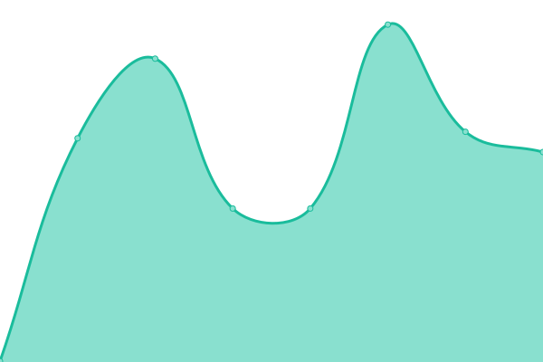 347ms
     
 | 

<a href="https://quanhieu.github.io/alive_up/history/haruki-fansub">100.00%</a>
    

|  [futarisubteam](https://futarisubteam.wordpress.com/) | 🟩 Up | [futarisubteam.yml](https://github.com/quanhieu/alive_up/commits/HEAD/history/futarisubteam.yml) | 

 430ms
     
 | 

<a href="https://quanhieu.github.io/alive_up/history/futarisubteam">100.00%</a>
    

|  [amechanfansub](https://amechanfansub.wordpress.com/) | 🟩 Up | [amechanfansub.yml](https://github.com/quanhieu/alive_up/commits/HEAD/history/amechanfansub.yml) | 

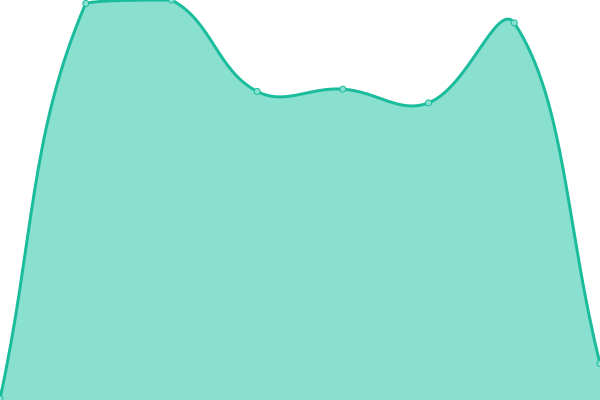 403ms
     
 | 

<a href="https://quanhieu.github.io/alive_up/history/amechanfansub">100.00%</a>
    

|  [kokocon](http://fansub.kokocon.net/) | 🟥 Down | [kokocon.yml](https://github.com/quanhieu/alive_up/commits/HEAD/history/kokocon.yml) | 

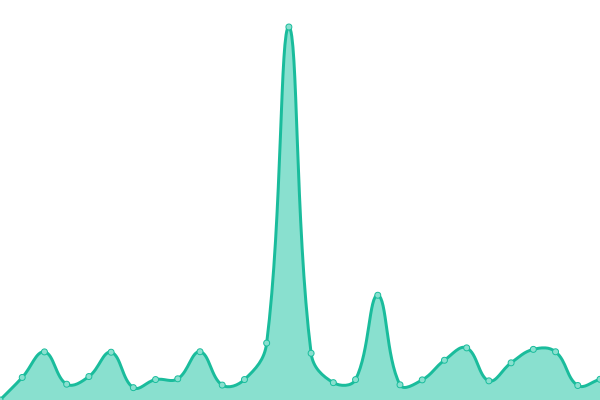 1178ms
     
 | 

<a href="https://quanhieu.github.io/alive_up/history/kokocon">90.11%</a>
    

|  [Hako](https://ln.hako.vn/) | 🟩 Up | [hako.yml](https://github.com/quanhieu/alive_up/commits/HEAD/history/hako.yml) | 

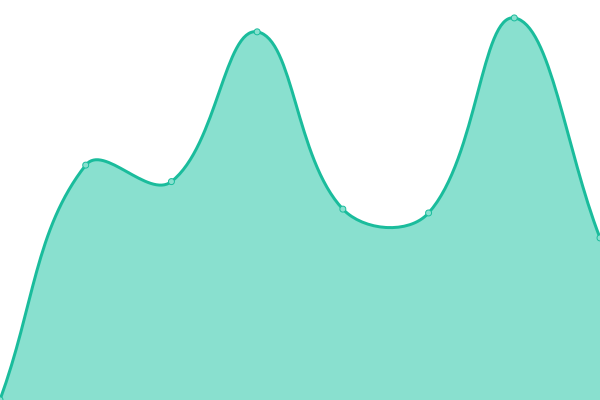 1220ms
     
 | 

<a href="https://quanhieu.github.io/alive_up/history/hako">100.00%</a>
    

|  [Hako again](https://docln.net/) | 🟩 Up | [hako-again.yml](https://github.com/quanhieu/alive_up/commits/HEAD/history/hako-again.yml) | 

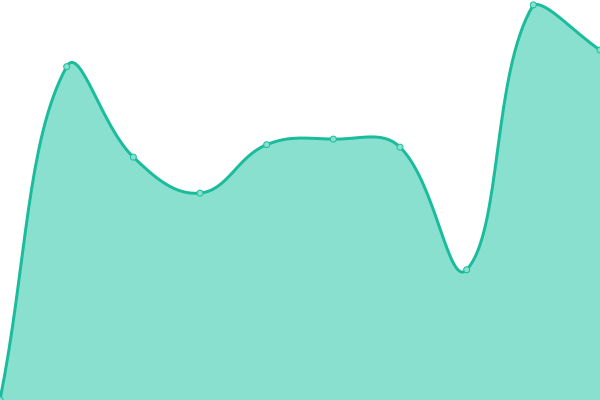 1001ms
     
 | 

<a href="https://quanhieu.github.io/alive_up/history/hako-again">100.00%</a>
    

|  [shinigamilnteam](https://shinigamilnteam.com/) | 🟩 Up | [shinigamilnteam.yml](https://github.com/quanhieu/alive_up/commits/HEAD/history/shinigamilnteam.yml) | 

 2127ms
     
 | 

<a href="https://quanhieu.github.io/alive_up/history/shinigamilnteam">100.00%</a>
    

|  [baka-tsuki](https://www.baka-tsuki.org/project/index.php?title=Category:Light_novel_(Vietnamese)) | 🟩 Up | [baka-tsuki.yml](https://github.com/quanhieu/alive_up/commits/HEAD/history/baka-tsuki.yml) | 

 615ms
     
 | 

<a href="https://quanhieu.github.io/alive_up/history/baka-tsuki">100.00%</a>
    

|  [valvrareteam](http://valvrareteam.com/) | 🟩 Up | [valvrareteam.yml](https://github.com/quanhieu/alive_up/commits/HEAD/history/valvrareteam.yml) | 

 1773ms
     
 | 

<a href="https://quanhieu.github.io/alive_up/history/valvrareteam">100.00%</a>
    

|  [sonako](https://sonako.fandom.com/vi/wiki/Sonako_Light_Novel) | 🟩 Up | [sonako.yml](https://github.com/quanhieu/alive_up/commits/HEAD/history/sonako.yml) | 

 932ms
     
 | 

<a href="https://quanhieu.github.io/alive_up/history/sonako">100.00%</a>
    

|  [otakusan](https://otakusan.net/LightNovel) | 🟥 Down | [otakusan.yml](https://github.com/quanhieu/alive_up/commits/HEAD/history/otakusan.yml) | 

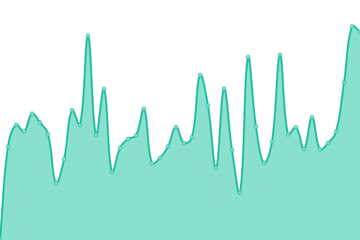 10702ms
     
 | 

<a href="https://quanhieu.github.io/alive_up/history/otakusan">99.23%</a>
    

|  [meobietbay](https://meobietbay.com/overlord/) | 🟩 Up | [meobietbay.yml](https://github.com/quanhieu/alive_up/commits/HEAD/history/meobietbay.yml) | 

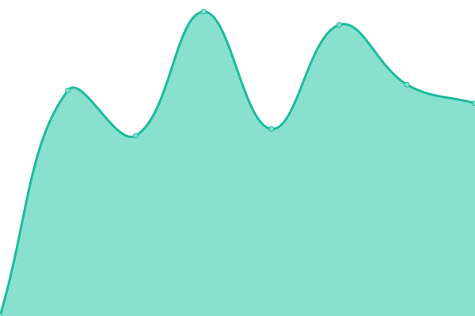 4228ms
     
 | 

<a href="https://quanhieu.github.io/alive_up/history/meobietbay">100.00%</a>
    

|  [thatnovelcorner](https://thatnovelcorner.com/light-novels/) | 🟩 Up | [thatnovelcorner.yml](https://github.com/quanhieu/alive_up/commits/HEAD/history/thatnovelcorner.yml) | 

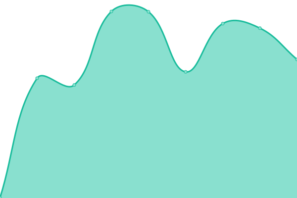 1147ms
     
 | 

<a href="https://quanhieu.github.io/alive_up/history/thatnovelcorner">100.00%</a>
    

|  [novelupdates](https://www.novelupdates.com/) | 🟩 Up | [novelupdates.yml](https://github.com/quanhieu/alive_up/commits/HEAD/history/novelupdates.yml) | 

 98ms
     
 | 

<a href="https://quanhieu.github.io/alive_up/history/novelupdates">100.00%</a>
    

|  [dwrteam](https://dwrteam.blogspot.com/) | 🟩 Up | [dwrteam.yml](https://github.com/quanhieu/alive_up/commits/HEAD/history/dwrteam.yml) | 

 521ms
     
 | 

<a href="https://quanhieu.github.io/alive_up/history/dwrteam">100.00%</a>
    

|  [zennomi](https://zennomi.fandom.com/wiki/Zennomi_Wiki) | 🟩 Up | [zennomi.yml](https://github.com/quanhieu/alive_up/commits/HEAD/history/zennomi.yml) | 

 315ms
     
 | 

<a href="https://quanhieu.github.io/alive_up/history/zennomi">100.00%</a>
    

|  [Zennomi](https://www.facebook.com/Zennomi) | 🟩 Up | [zennomi.yml](https://github.com/quanhieu/alive_up/commits/HEAD/history/zennomi.yml) | 

 315ms
     
 | 

<a href="https://quanhieu.github.io/alive_up/history/zennomi">100.00%</a>
    

|  [Zennomi again](https://zenno.moe/) | 🟥 Down | [zennomi-again.yml](https://github.com/quanhieu/alive_up/commits/HEAD/history/zennomi-again.yml) | 

 0ms
     
 | 

<a href="https://quanhieu.github.io/alive_up/history/zennomi-again">0.00%</a>
    

|  [Đứa biết nhiều nhất về Light Novel ở Việt Nam](https://www.facebook.com/NaviRanobe/) | 🟩 Up | [dua-biet-nhieu-nhat-ve-light-novel-o-viet-nam.yml](https://github.com/quanhieu/alive_up/commits/HEAD/history/dua-biet-nhieu-nhat-ve-light-novel-o-viet-nam.yml) | 

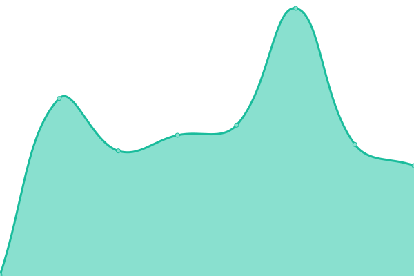 286ms
     
 | 

<a href="https://quanhieu.github.io/alive_up/history/dua-biet-nhieu-nhat-ve-light-novel-o-viet-nam">100.00%</a>
    

|  [Xemphim club](https://xemphim.club/) | 🟩 Up | [xemphim-club.yml](https://github.com/quanhieu/alive_up/commits/HEAD/history/xemphim-club.yml) | 

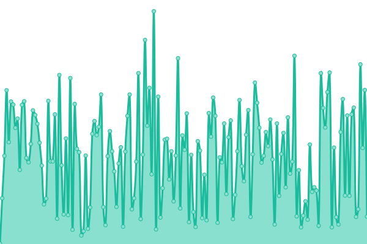 557ms
     
 | 

<a href="https://quanhieu.github.io/alive_up/history/xemphim-club">100.00%</a>
    

|  [Xemphim club again](https://phimtea.com/) | 🟩 Up | [xemphim-club-again.yml](https://github.com/quanhieu/alive_up/commits/HEAD/history/xemphim-club-again.yml) | 

 259ms
     
 | 

<a href="https://quanhieu.github.io/alive_up/history/xemphim-club-again">100.00%</a>
    

|  [kokocon](https://tracker.kokocon.net/) | 🟥 Down | [kokocon.yml](https://github.com/quanhieu/alive_up/commits/HEAD/history/kokocon.yml) | 

 1178ms
     
 | 

<a href="https://quanhieu.github.io/alive_up/history/kokocon">90.10%</a>
    

|  [Ve o zet](https://voz.vn/) | 🟩 Up | [ve-o-zet.yml](https://github.com/quanhieu/alive_up/commits/HEAD/history/ve-o-zet.yml) | 

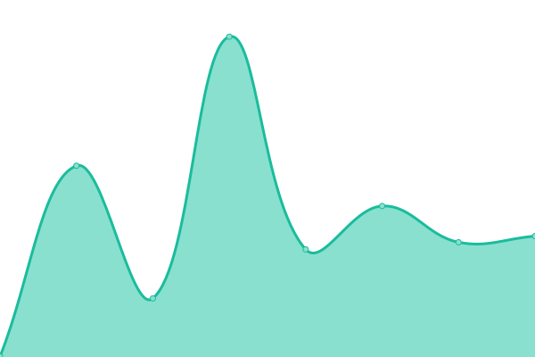 181ms
     
 | 

<a href="https://quanhieu.github.io/alive_up/history/ve-o-zet">100.00%</a>
    

|  [vnsharing](https://vnsharing.vn/) | 🟩 Up | [vnsharing.yml](https://github.com/quanhieu/alive_up/commits/HEAD/history/vnsharing.yml) | 

 2022ms
     
 | 

<a href="https://quanhieu.github.io/alive_up/history/vnsharing">100.00%</a>
    

|  [vnsharing again](https://vnsharing.site/) | 🟥 Down | [vnsharing-again.yml](https://github.com/quanhieu/alive_up/commits/HEAD/history/vnsharing-again.yml) | 

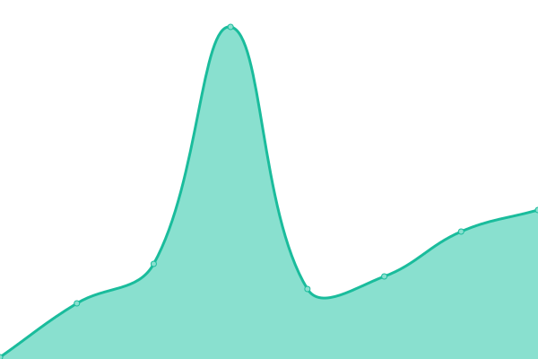 101ms
     
 | 

<a href="https://quanhieu.github.io/alive_up/history/vnsharing-again">0.00%</a>
    

|  [anime-sharing](https://www.anime-sharing.com/forum/) | 🟩 Up | [anime-sharing.yml](https://github.com/quanhieu/alive_up/commits/HEAD/history/anime-sharing.yml) | 

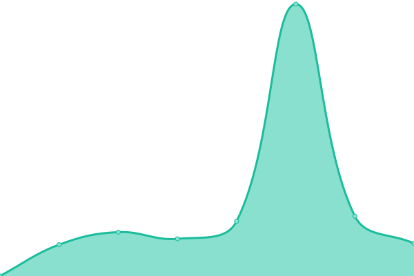 1145ms
     
 | 

<a href="https://quanhieu.github.io/alive_up/history/anime-sharing">98.90%</a>
    

|  [kokocon](http://kokocon.net/) | 🟥 Down | [kokocon.yml](https://github.com/quanhieu/alive_up/commits/HEAD/history/kokocon.yml) | 

 1178ms
     
 | 

<a href="https://quanhieu.github.io/alive_up/history/kokocon">90.09%</a>
    

|  [hako.re](https://mangochan.site/) | 🟩 Up | [hako-re.yml](https://github.com/quanhieu/alive_up/commits/HEAD/history/hako-re.yml) | 

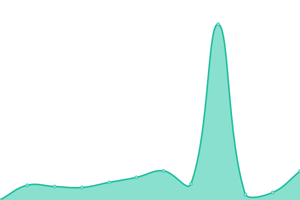 1091ms
     
 | 

<a href="https://quanhieu.github.io/alive_up/history/hako-re">99.67%</a>
    

|  [myanimelist](https://myanimelist.net/) | 🟩 Up | [myanimelist.yml](https://github.com/quanhieu/alive_up/commits/HEAD/history/myanimelist.yml) | 

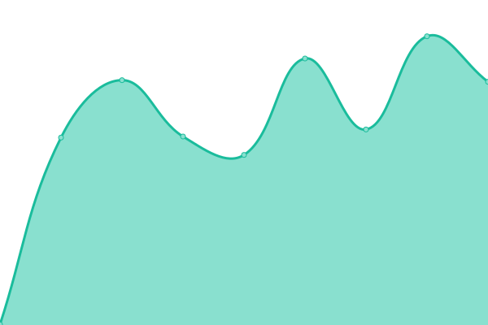 1599ms
     
 | 

<a href="https://quanhieu.github.io/alive_up/history/myanimelist">100.00%</a>
    

|  [anime-planet](https://www.anime-planet.com/) | 🟥 Down | [anime-planet.yml](https://github.com/quanhieu/alive_up/commits/HEAD/history/anime-planet.yml) | 

 126ms
     
 | 

<a href="https://quanhieu.github.io/alive_up/history/anime-planet">37.39%</a>
    

<!--end: status pages-->

[**Visit our status website →**](https://quanhieu.github.io/alive_up/)

## 📄 License

- Powered by: [Upptime](https://github.com/upptime/upptime)
- Code: [MIT](./LICENSE) © [This me](https://quanhieu.github.io/alive_up/)
- Data in the `./history` directory: [Open Database License](https://opendatacommons.org/licenses/odbl/1-0/)
